# CNF — Architecture

**Project**: CNF v0.1.0

---

## 1. System Overview

CNF is a decentralized, federated OpenStack management system that enables seamless VM workload distribution, cold migration, and live migration across independent OpenStack clusters — without any external control plane.

---

## 2. Federation Topology

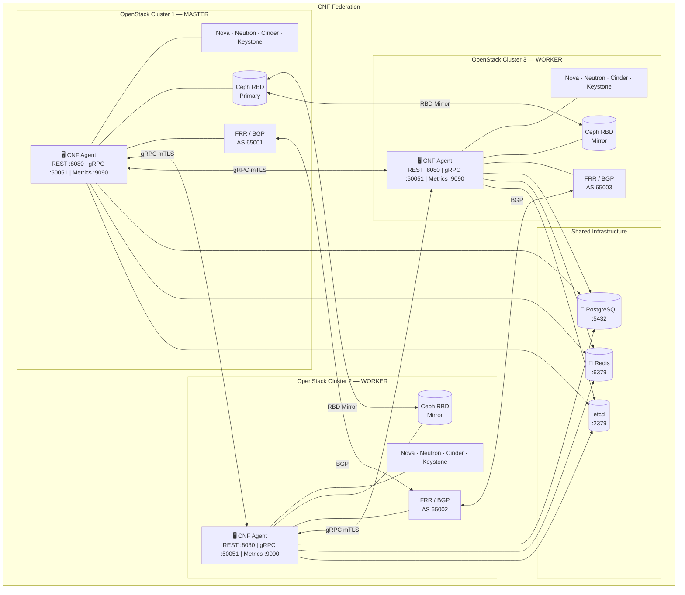

---

## 3. Layered Architecture

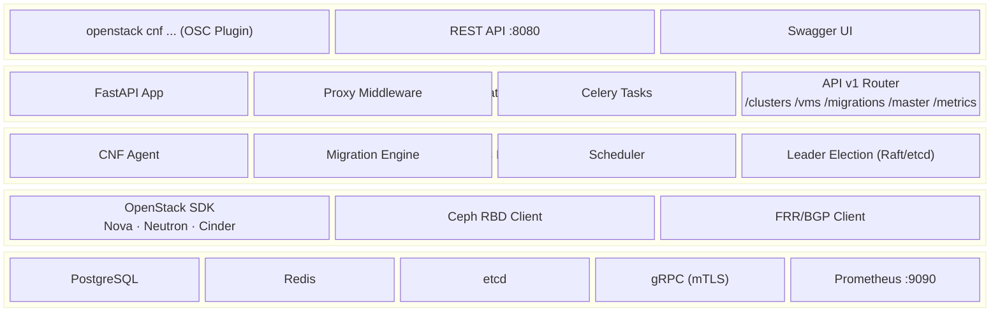

---

## 4. CNF Agent — Internal Component View

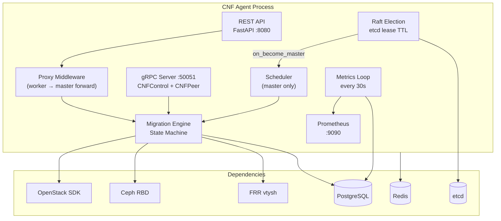

---

## 5. Leader Election

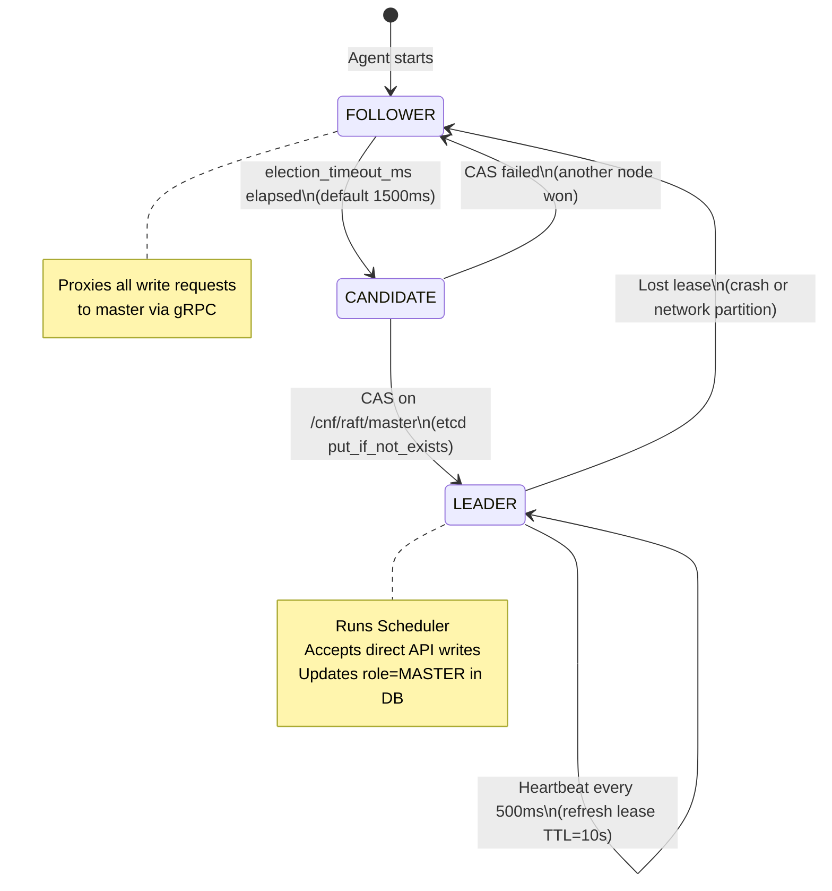

---

## 6. Cold Migration Flow

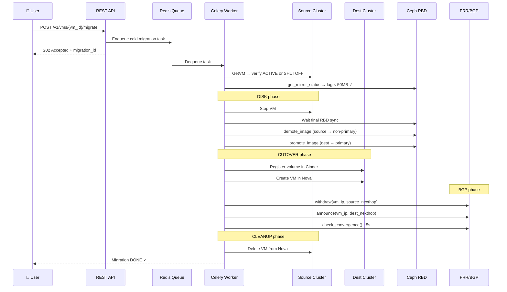

---

## 7. Live Migration Flow

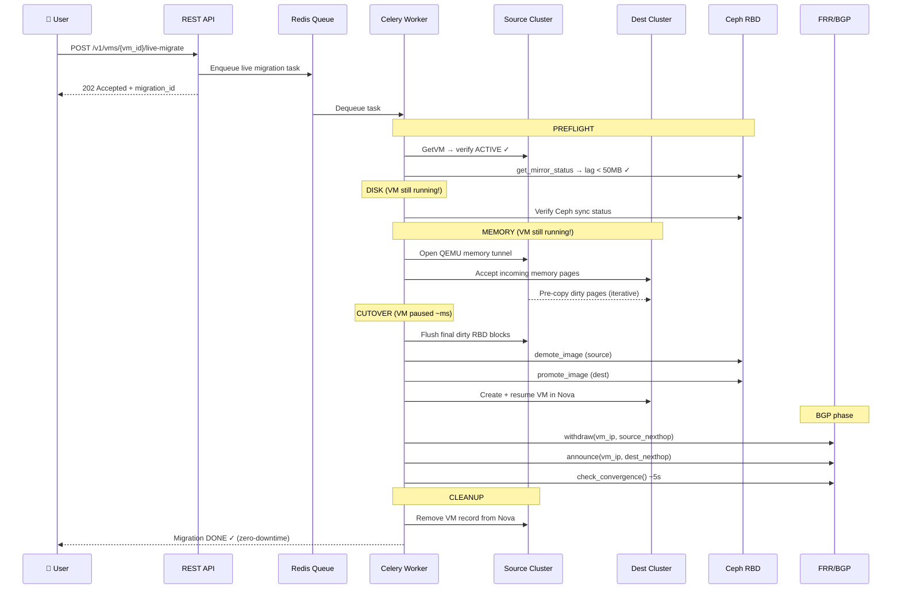

---

## 8. Migration State Machine

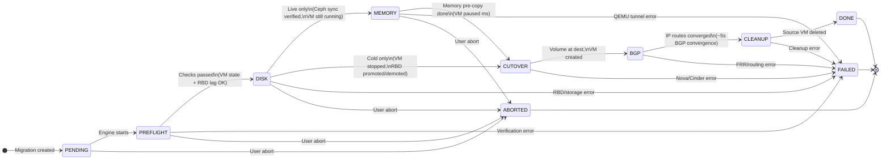

---

## 9. Storage Architecture (Ceph RBD)

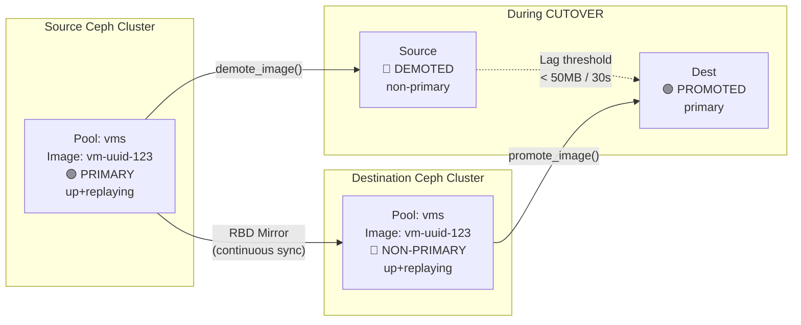

---

## 10. Network / BGP Architecture

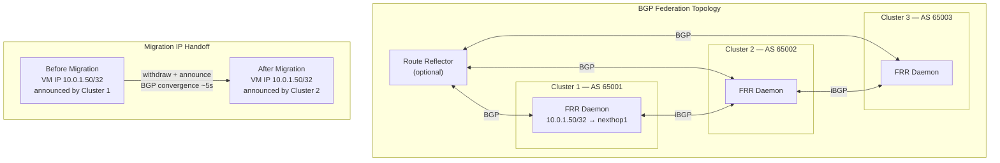

---

## 11. Database Schema

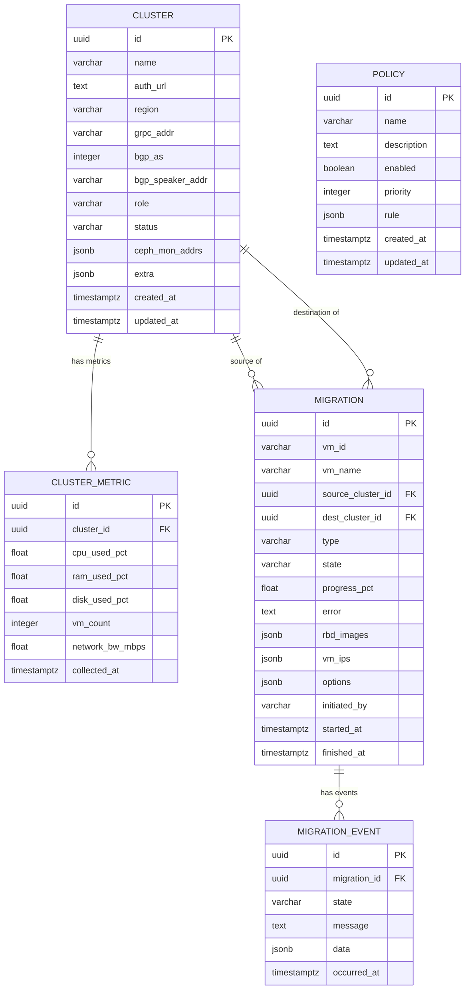

---

## 12. Security Architecture

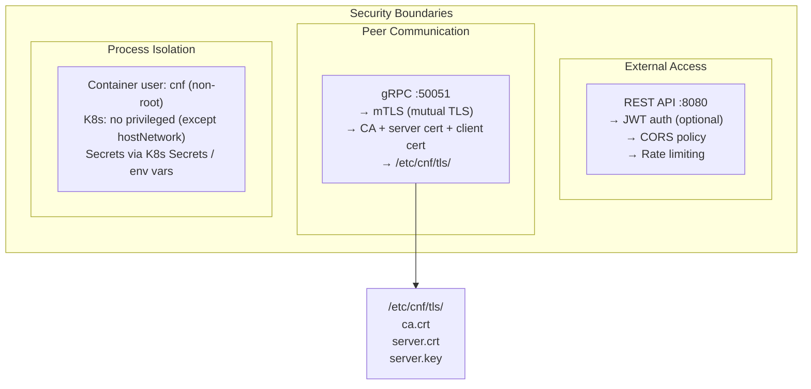

---

## 13. Technology Stack

| Layer | Technology | Version | Purpose |
| --- | --- | --- | --- |
| Language | Python | 3.11+ | Core agent runtime |
| API Framework | FastAPI | ≥ 0.110 | REST API server |
| ASGI Server | Uvicorn | ≥ 0.27 | Async HTTP |
| RPC Framework | gRPC | ≥ 1.62 | Peer communication |
| ORM | SQLAlchemy | ≥ 2.0 | Async ORM |
| Database | PostgreSQL | ≥ 14 | Persistent state |
| Task Queue | Celery + Redis | ≥ 5.3 | Async migration tasks |
| Leader Election | etcd | ≥ 3.5 | Distributed consensus |
| Storage | Ceph RBD | ≥ Pacific | VM disk mirroring |
| Networking | FRR | ≥ 8.0 | BGP route management |
| OpenStack | openstacksdk | ≥ 3.0 | Nova/Neutron/Cinder |
| Observability | Prometheus + structlog | latest | Metrics + logging |
| Config | Pydantic | ≥ 2.0 | Settings validation |
| DB Migrations | Alembic | ≥ 1.13 | Schema versioning |

---

*For deployment details see [Deployment Plan](DeploymentPlan.md). For startup order see [Startup Guide](StartupGuide.md).*
