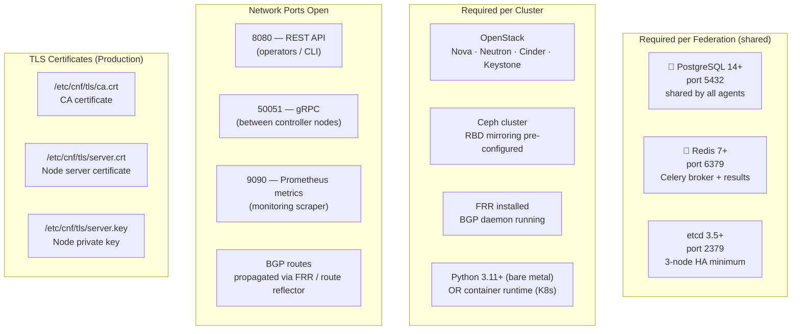
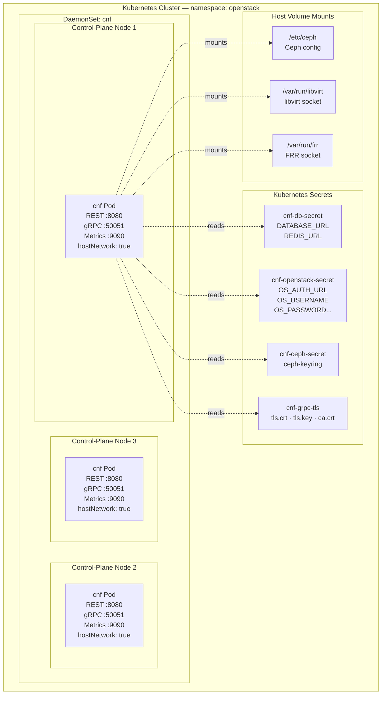
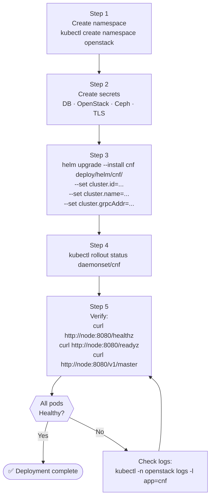
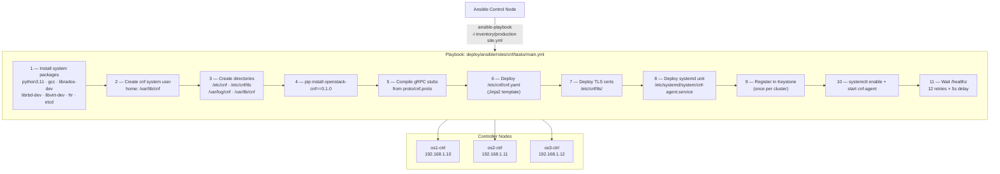
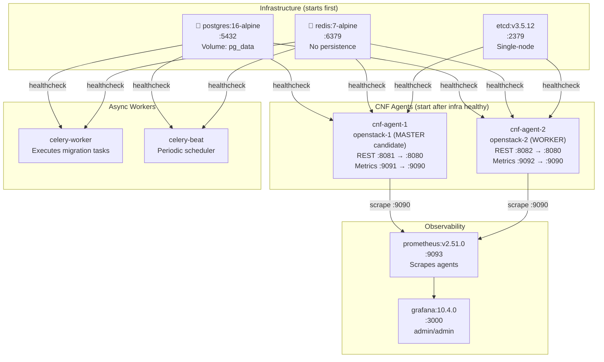
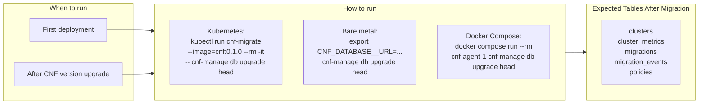
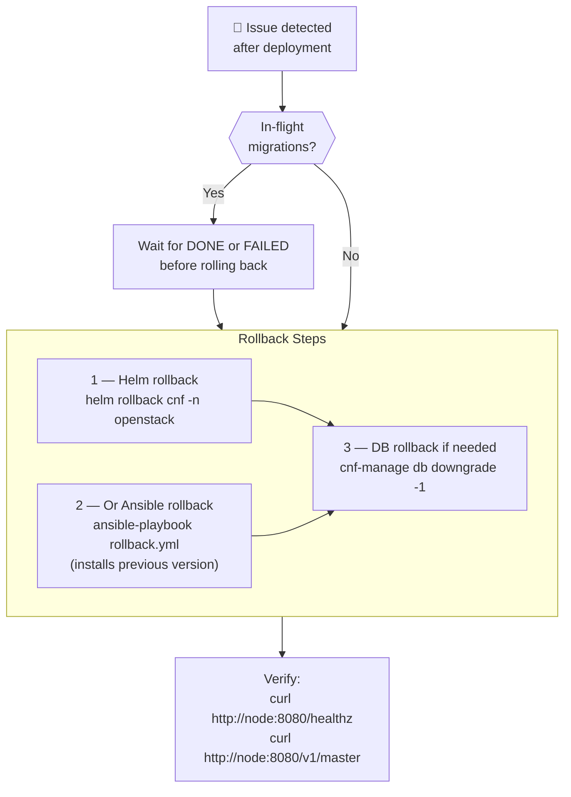
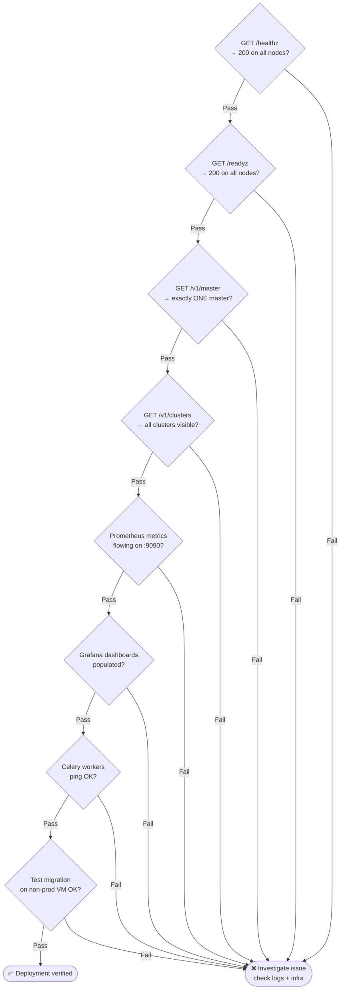

# CNF — Deployment Plan

**Project**: CNF v0.1.0
**Date**: 2026-04-27

---

## 1. Deployment Environments

```mermaid
graph LR
    subgraph DEV["🧪 Development"]
        direction TB
        DC_TOOL["Tool: Docker Compose"]
        DC_TARGET["Target: Local workstation"]
        DC_NOTES["Full stack in containers\npostgres · redis · etcd\n2 CNF agents · celery\nprometheus · grafana"]
    end

    subgraph STG["🔧 Staging"]
        direction TB
        ANS_TOOL["Tool: Ansible + systemd"]
        ANS_TARGET["Target: Bare-metal\ncontroller nodes"]
        ANS_NOTES["Direct pip install\nSystemd unit\nReal OpenStack\nReal Ceph + FRR"]
    end

    subgraph PROD["🚀 Production"]
        direction TB
        HLM_TOOL["Tool: Helm DaemonSet"]
        HLM_TARGET["Target: Kubernetes\ncontrol-plane nodes"]
        HLM_NOTES["One pod per node\nhostNetwork: true\nHost mounts:\n/etc/ceph /var/run/libvirt /var/run/frr"]
    end

    DEV -->|"promote config"| STG
    STG -->|"promote config"| PROD
```



---

## 2. Prerequisites



---

## 3. Option A — Kubernetes (Helm)

### 3.1 Architecture



### 3.2 Helm Deployment Steps



---

## 4. Option B — Ansible (Bare Metal)

### 4.1 Ansible Execution Flow



---

## 5. Option C — Docker Compose (Development)

### 5.1 Service Dependency Graph



### 5.2 Quick Start

```bash
cd openstack-cnf
docker compose up --build

# Verify
curl http://localhost:8081/healthz
curl http://localhost:8082/healthz
curl http://localhost:8081/v1/master
open http://localhost:3000   # Grafana (admin/admin)
```

---

## 6. Database Migration



---

## 7. Rollback Plan



---

## 8. Post-Deployment Verification Checklist



---

## 9. Environment Configuration Comparison

| Parameter | Development | Staging | Production |
| --- | --- | --- | --- |
| `log_format` | console | json | json |
| `log_level` | DEBUG | INFO | INFO |
| `grpc.tls_enabled` | false | true | true |
| `bgp.enabled` | false | true | true |
| `raft.etcd_endpoints` | single node | 3-node | 3-node |
| `celery.task_time_limit` | 3600s | 7200s | 7200s |
| Ceph | mock/disabled | real | real |
| OpenStack | simulated | real staging | real production |

---

*For startup order details see [Startup Guide](StartupGuide.md). For architecture diagrams see [Architecture](Architecture.md).*
