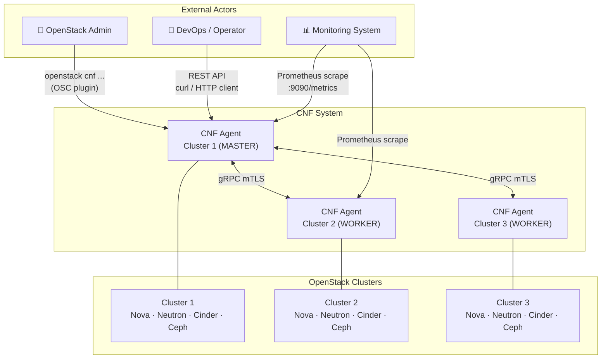
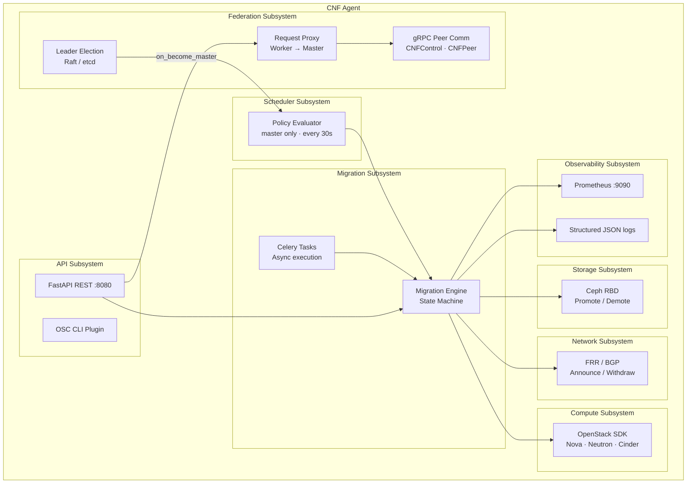
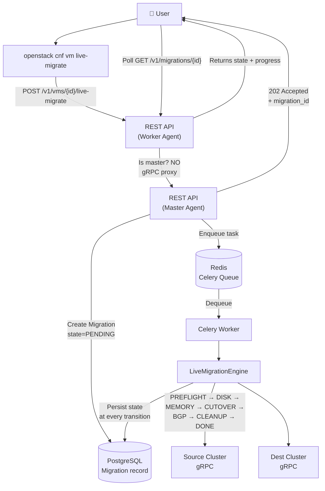
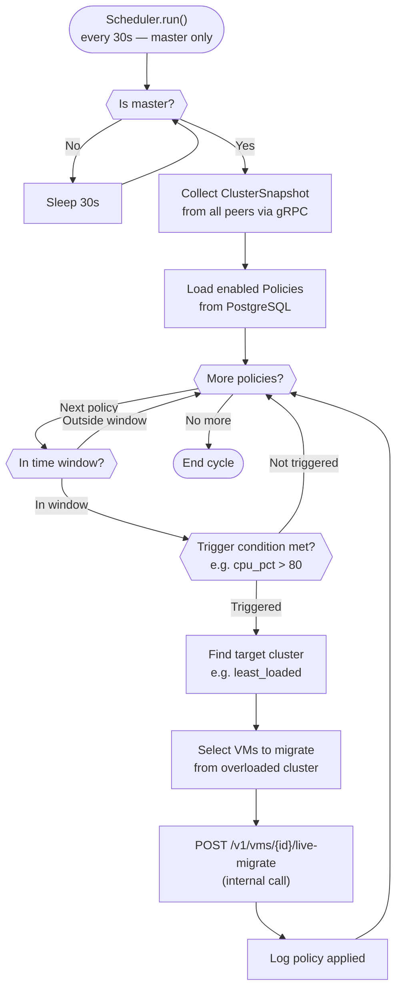
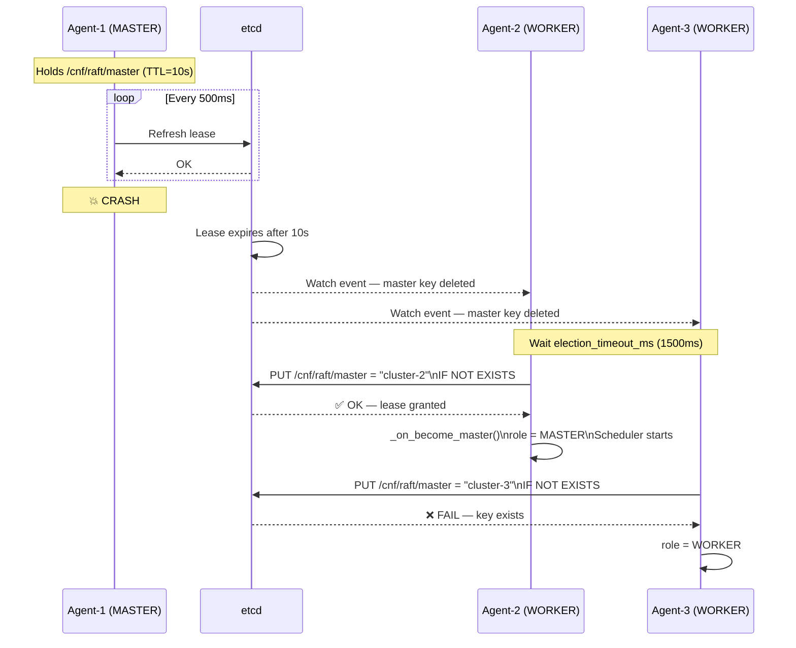
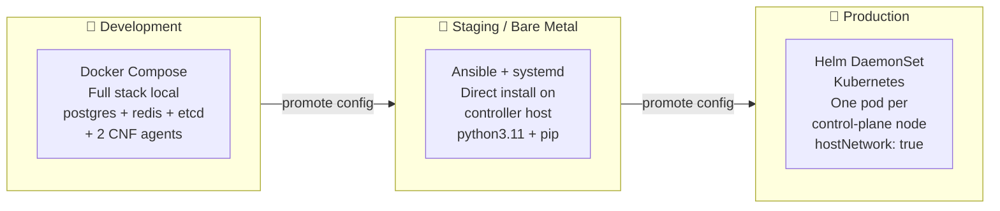
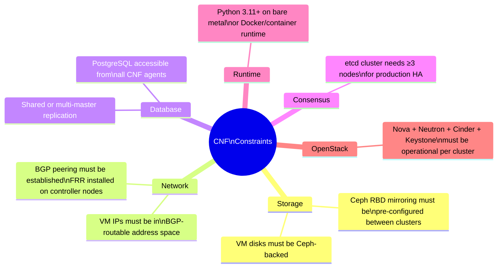

# CNF — High Level Design (HLD)

**Project**: CNF v0.1.0
**Date**: 2026-04-27

---

## 1. Business Problem

Modern multi-datacenter OpenStack deployments suffer from:

- **Resource stranding** — one cluster is over-provisioned while another is at capacity
- **VM lock-in** — moving a VM requires manual effort, downtime, and IP changes
- **No federation** — each OpenStack cluster is an isolated island
- **Operational toil** — migrations require coordinating Nova, Cinder, Neutron, Ceph, and networking manually

CNF solves these problems with a lightweight, decentralized federation layer on top of existing OpenStack.

---

## 2. System Context

---

## 3. Major Subsystems

---

## 4. Request Flow — User-Initiated Migration

---

## 5. Auto-Rebalancing Flow (Policy-Driven)

---

## 6. Leader Failover Flow

---

## 7. Deployment Model

---

## 8. Non-Functional Requirements

| Requirement | Target | Mechanism |
| --- | --- | --- |
| **Availability** | 99.9% federation API | Leader re-election < 15s |
| **Live migration downtime** | < 5 seconds | QEMU pre-copy + BGP fast convergence |
| **Migration reliability** | Retry on transient failures | Celery retry + rollback handlers |
| **Observability** | All state transitions logged | structlog + Prometheus |
| **Security** | Encrypted peer comm | mTLS on gRPC |
| **Scalability** | 10+ clusters, 1000+ VMs | Async Python, Celery, connection pool |

---

## 9. Constraints and Assumptions

---

*See [Architecture](Architecture.md) for detailed component design. See [LLD](LLD.md) for module-level design.*
