# CNF — Low Level Design (LLD)

**Project**: CNF v0.1.0
**Date**: 2026-04-27

---

## 1. Module Map

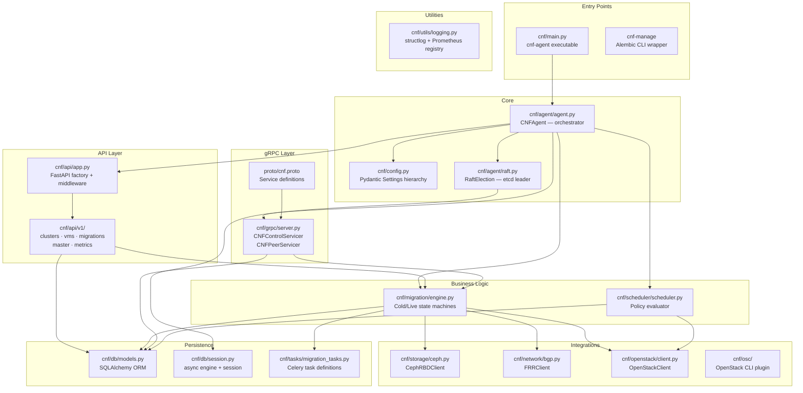

---

## 2. Class Diagram — Core Components

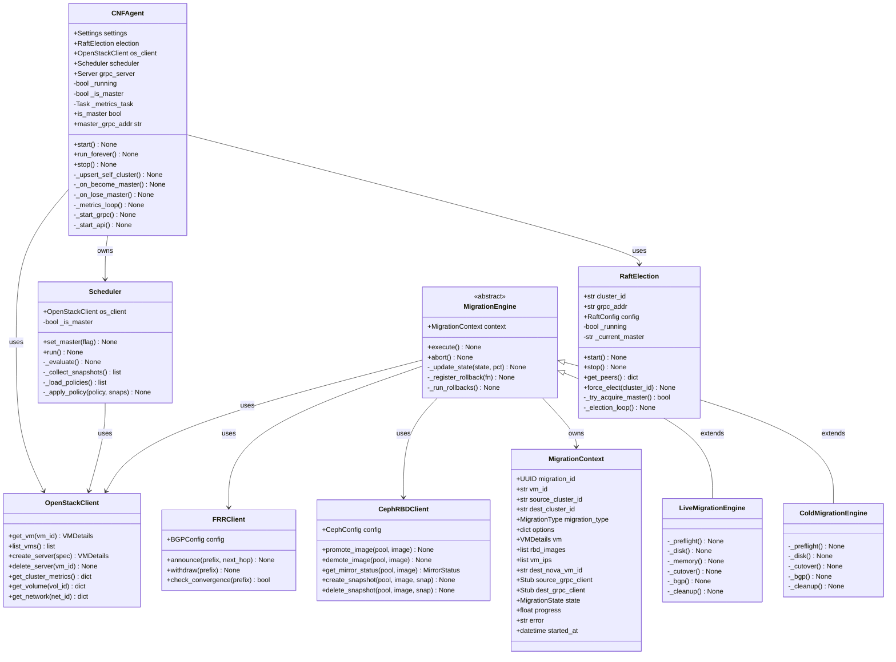

---

## 3. Configuration Hierarchy

```mermaid
graph TD
    S["Settings (root)"]

    S --> CLID["cluster_id: UUID"]
    S --> CLNAME["cluster_name: str"]
    S --> CLGRPC["cluster_grpc_addr: str"]
    S --> PEERS["peer_clusters: List[str]"]
    S --> LOG_CONF["log_level / log_format"]

    S --> CEPH_C["CephConfig"]
    S --> BGP_C["BGPConfig"]
    S --> GRPC_C["GRPCConfig"]
    S --> RAFT_C["RaftConfig"]
    S --> API_C["APIConfig"]
    S --> OS_C["OpenStackConfig"]
    S --> DB_C["DatabaseConfig"]
    S --> CEL_C["CeleryConfig"]
    S --> MET_C["MetricsConfig"]

    CEPH_C --> C1["conf_path\nkeyring_path\npool\nmirror_mode\nlag_threshold_bytes: 50MB\nlag_threshold_seconds: 30"]
    BGP_C --> B1["enabled\nas_number\nroute_reflector_addr\nbfd_enabled\nhold_time: 9s\nkeepalive: 3s\nconvergence_wait: 5s"]
    GRPC_C --> G1["port: 50051\ntls_enabled\ntls_cert / tls_key / tls_ca\nmax_message_length: 64MB"]
    RAFT_C --> R1["election_timeout_ms: 1500\nheartbeat_interval_ms: 500\nlease_ttl_seconds: 10\netcd_endpoints"]
    API_C --> A1["host: 0.0.0.0\nport: 8080\ncors_origins\njwt_secret"]
    OS_C --> O1["auth_url\nusername / password\nproject_name\nregion_name\ninterface: internal"]
    DB_C --> D1["url: postgresql+asyncpg://...\npool_size: 10\nmax_overflow: 20"]
    CEL_C --> CL1["broker_url: redis://...\nresult_backend\ntask_soft_time_limit: 3600s\ntask_time_limit: 7200s"]
    MET_C --> M1["port: 9090\ninterval: 30s"]
```

---

## 4. Migration Engine — State Machine

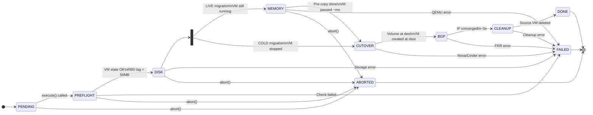

---

## 5. Agent Startup Sequence

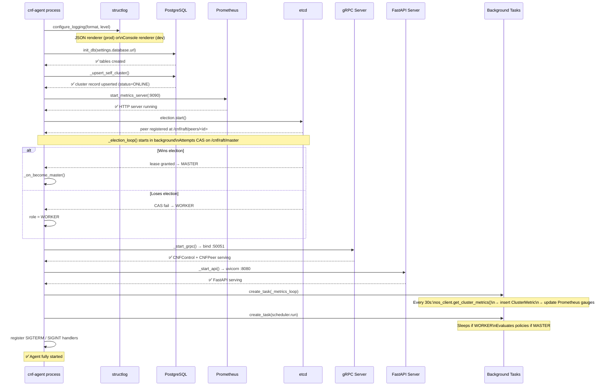

---

## 6. gRPC Service Interface

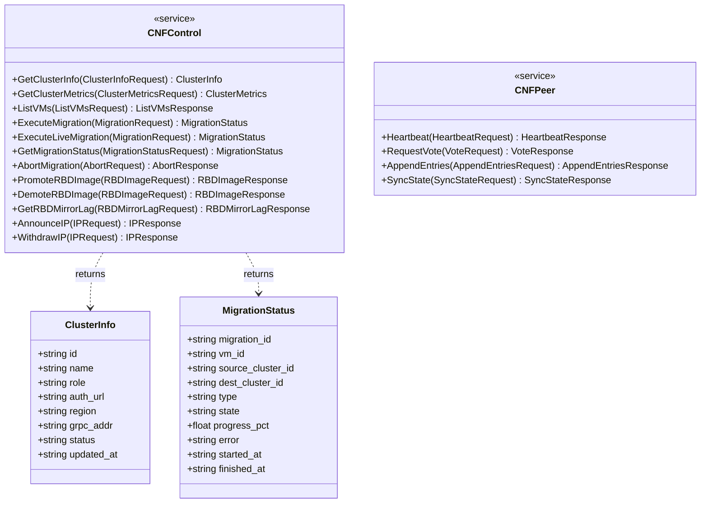

---

## 7. REST API Route Map

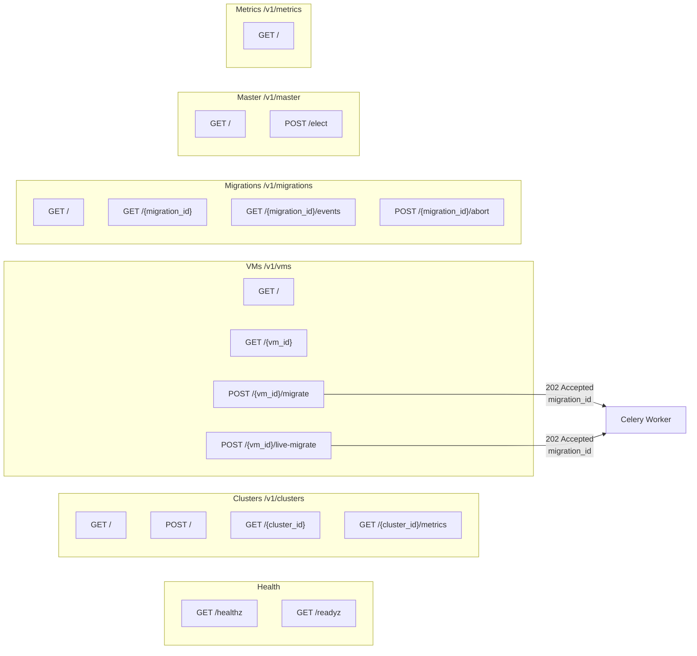

---

## 8. FastAPI Middleware Chain

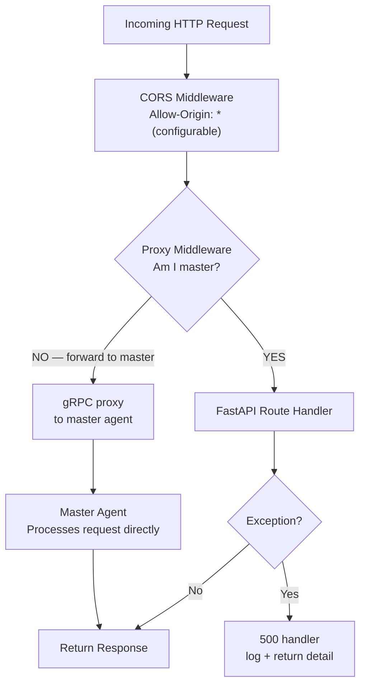

---

## 9. Celery Task Queue

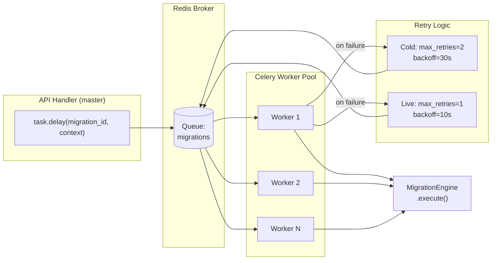

---

## 10. Prometheus Metrics Registry

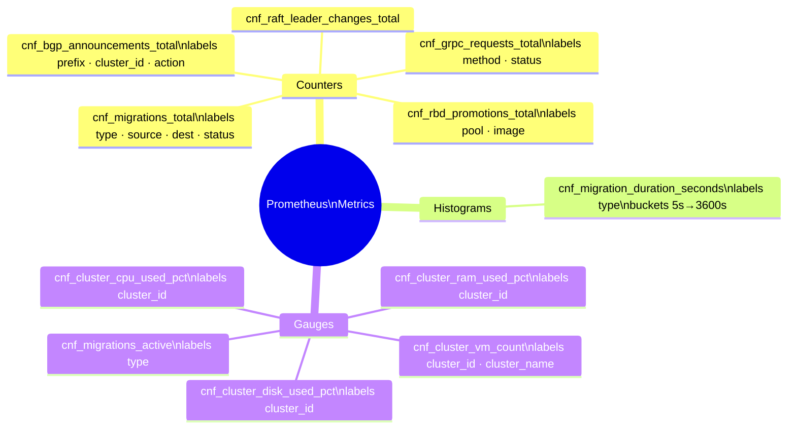

---

## 11. Database Schema

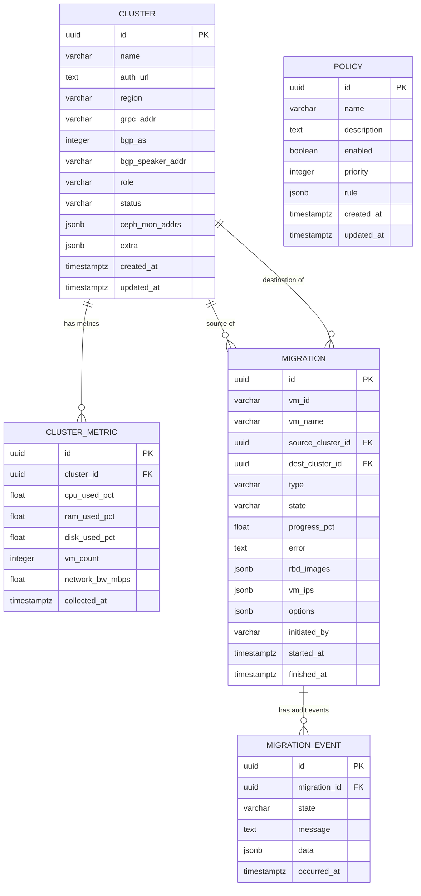

---

*For high-level view see [HLD](HLD.md). For deployment specifics see [Deployment Plan](DeploymentPlan.md).*
