# CNF — UML Diagrams

**Project**: CNF v0.1.0

> All diagrams use [Mermaid](https://mermaid.js.org/) and render natively in GitHub, GitLab, VS Code (Mermaid extension), and Obsidian.

---

## 1. Use Case Diagram

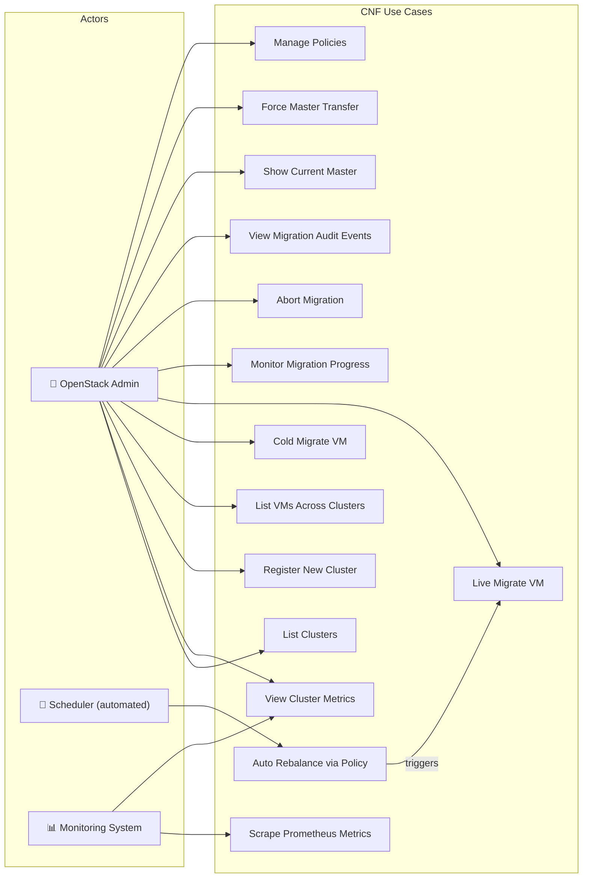

---

## 2. Class Diagram — Full System

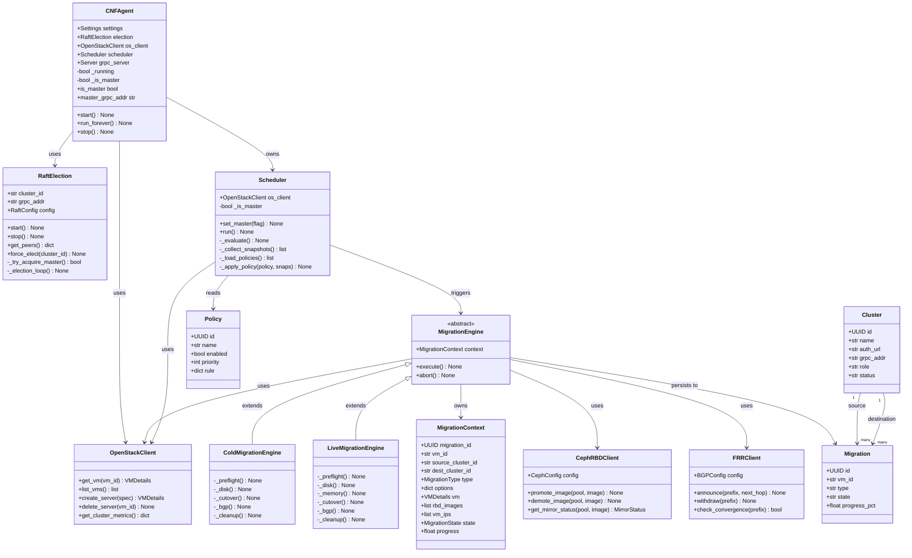

---

## 3. Sequence Diagram — Live Migration

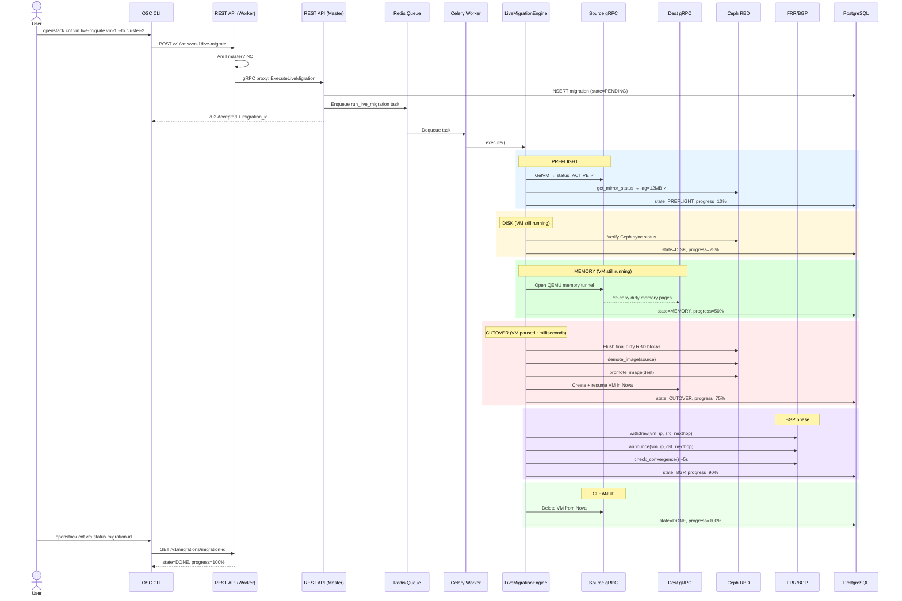

---

## 4. Sequence Diagram — Leader Election & Failover

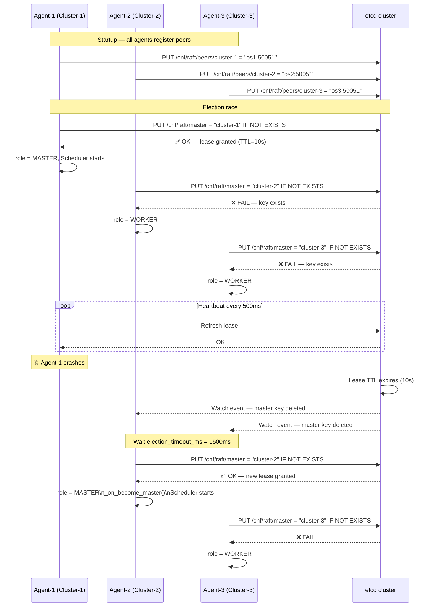

---

## 5. State Diagram — Migration States

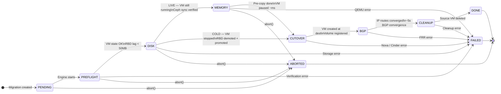

---

## 6. State Diagram — Raft Leader Election

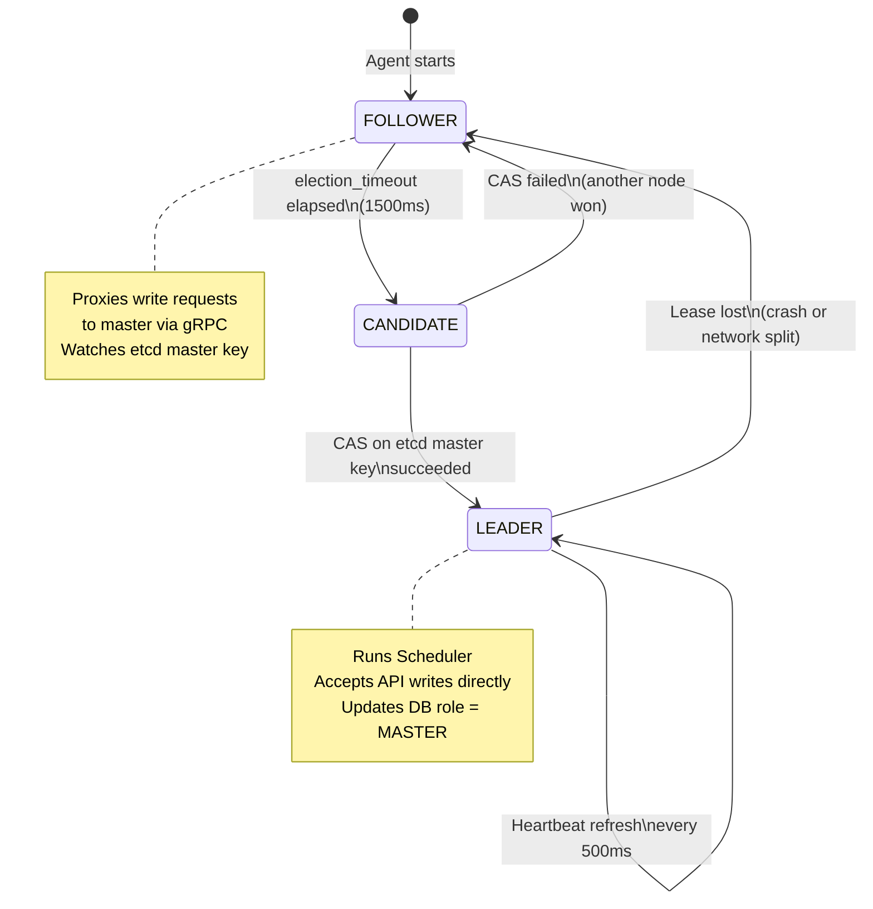

---

## 7. Activity Diagram — Scheduler Policy Evaluation

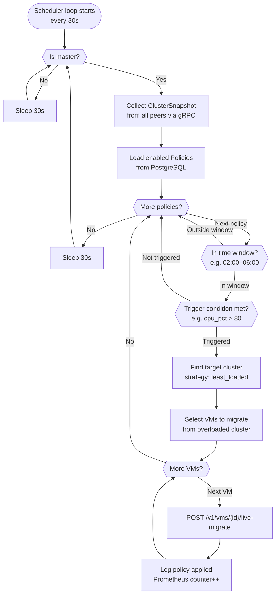

---

## 8. Component Diagram (C4 Style)

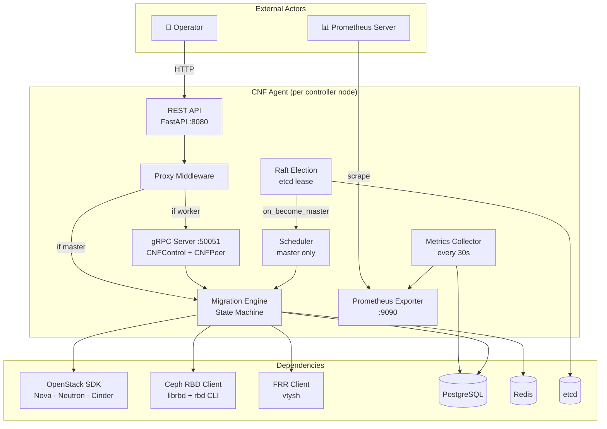

---

## 9. Deployment Diagram — Kubernetes

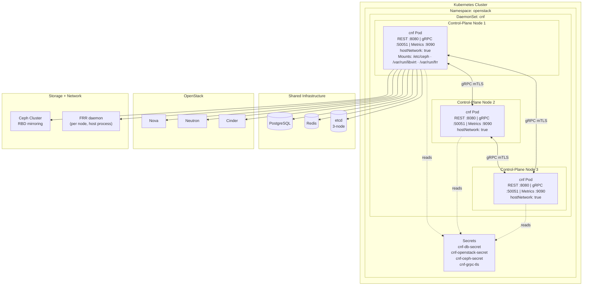

---

## 10. Entity-Relationship Diagram

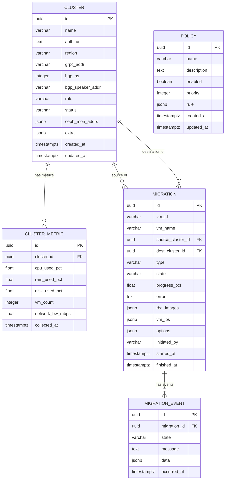

---

## 11. Sequence Diagram — Cold Migration

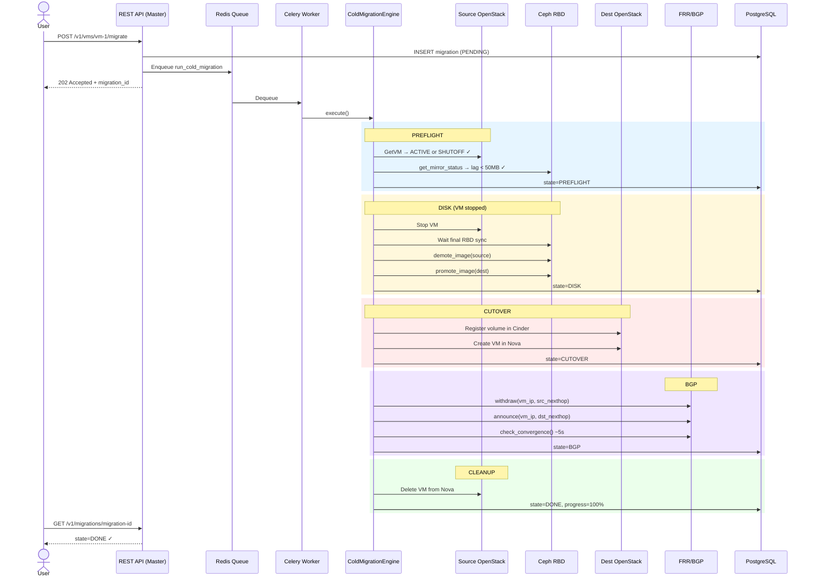

---

*Diagrams render with [Mermaid](https://mermaid.js.org/). View them in GitHub, GitLab, VS Code, or [mermaid.live](https://mermaid.live).*
